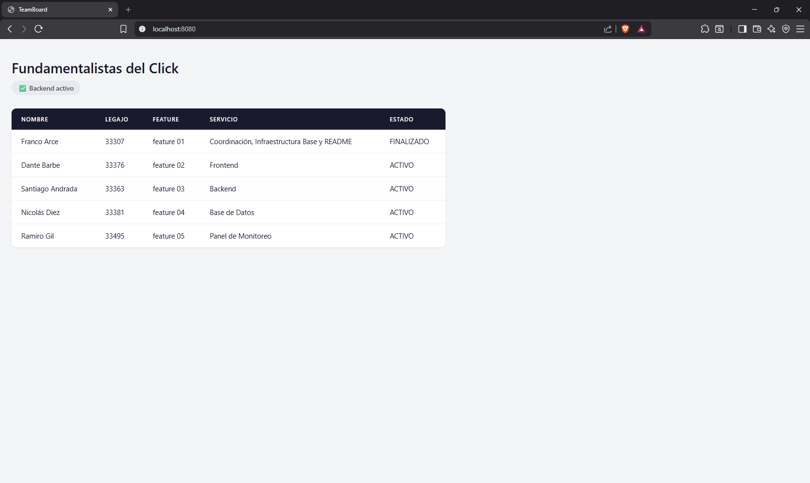
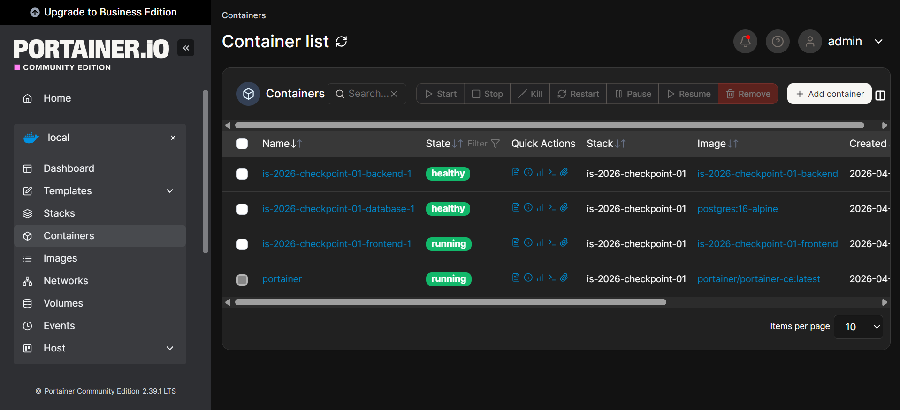

# TeamBoard App — IS-2026 Checkpoint 01

Aplicación web que muestra los integrantes del equipo, la feature que implementó cada uno y el estado de su servicio.

## Integrantes

| Nombre   | Apellido | Legajo | Feature    | Servicio                                     |
| -------- | -------- | ------ | ---------- | -------------------------------------------- |
| Franco   | Arce     | 33307  | Feature 01 | Coordinación, Infraestructura Base y README |
| Dante    | Barbe    | 33376  | Feature 02 | Frontend                                     |
| Santiago | Andrada  | 33363  | Feature 03 | Backend                                      |
| Nicolás | Diez     | 33381  | Feature 04 | Base de Datos                                |
| Ramiro   | Gil      | 33495  | Feature 05 | Panel de Monitoreo                           |

## Requisitos previos

- Docker
- Docker Compose

## Cómo ejecutar el proyecto

1. Clonar el repositorio:

```bash
   git clone https://github.com/TU-USUARIO/is-2026-checkpoint-01.git
   cd is-2026-checkpoint-01
```

2. Copiar el archivo de variables de entorno y completar los valores:

```bash
   cp .env.example .env
```

3. Levantar los servicios:

```bash
   docker compose up -d --build
```

4. Verificar que todos los servicios estén corriendo:

```bash
   docker compose ps
```

5. Abrir la aplicación en el navegador: http://localhost:8080

## Descripción de servicios

| Servicio  | Puerto | Descripción                                                                                                                 |
| --------- | ------ | ---------------------------------------------------------------------------------------------------------------------------- |
| Frontend  | 8080   | Página web servida con Python http.server. Muestra la tabla de integrantes consumiendo datos del backend.                   |
| Backend   | 5000   | API REST desarrollada con Flask. Expone los endpoints /api/health, /api/team y /api/info. Lee los datos desde PostgreSQL.    |
| Database  | —     | Base de datos PostgreSQL 16. Almacena los datos del equipo en la tabla members. Se inicializa automáticamente con init.sql. |
| Portainer | 9000   | Panel de monitoreo web para gestionar los contenedores Docker.                                                               |

## Endpoints del backend

| Método | Endpoint    | Descripción                                             |
| ------- | ----------- | -------------------------------------------------------- |
| GET     | /api/health | Estado del servicio (usado por el healthcheck de Docker) |
| GET     | /api/team   | Lista de integrantes del equipo desde la base de datos   |
| GET     | /api/info   | Metadata del servicio                                    |

## Panel de monitoreo — Portainer

Portainer es una interfaz web que permite visualizar y administrar todos los contenedores Docker desde el navegador sin necesidad de usar la terminal.

**Acceso:** http://localhost:9000

La primera vez que se accede, Portainer solicita crear un usuario administrador.
Una vez dentro, ir a **Local → Containers** para ver el estado de todos los servicios del proyecto.

El servicio monta el socket de Docker (`/var/run/docker.sock`) para comunicarse con el daemon, y utiliza un volumen nombrado (`portainer_data`) para persistir la configuración entre reinicios.

### TeamBoard App



### Portainer



